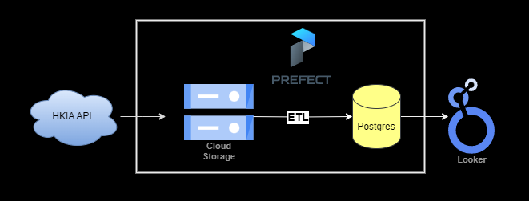
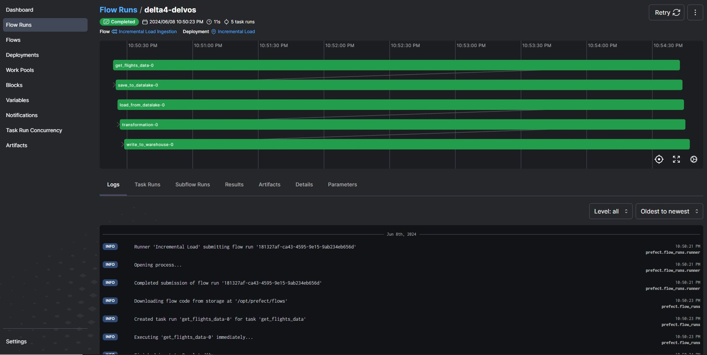
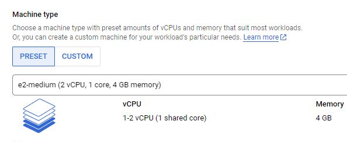
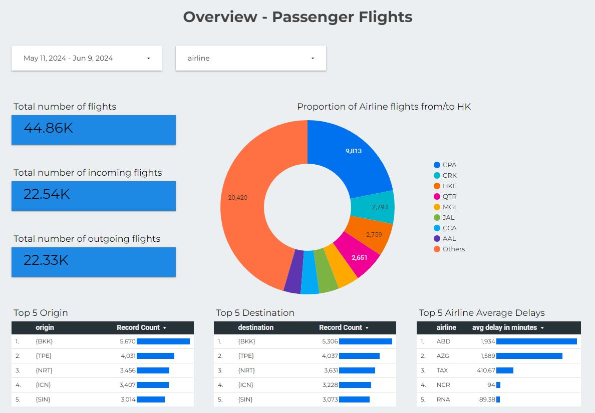
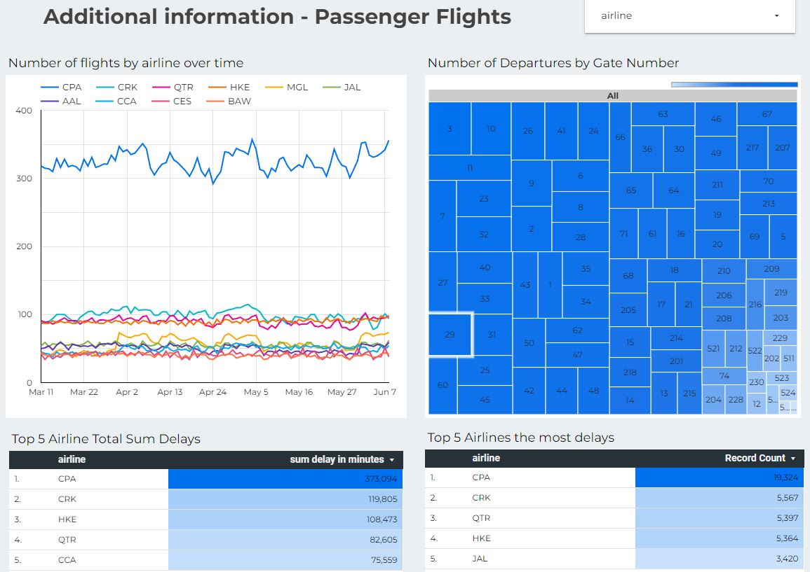
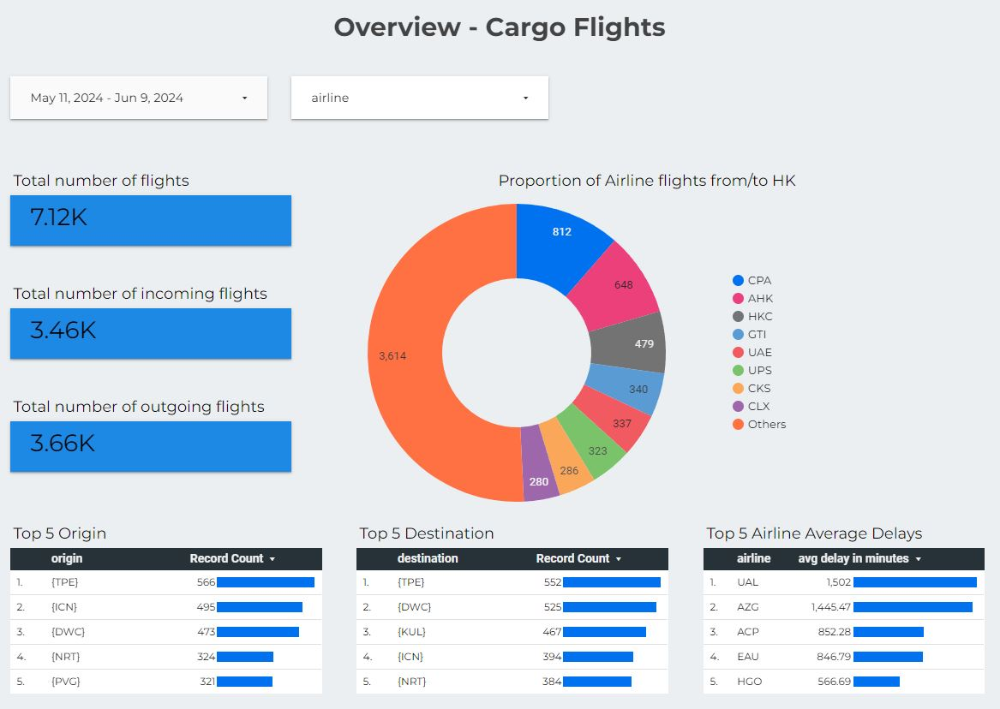
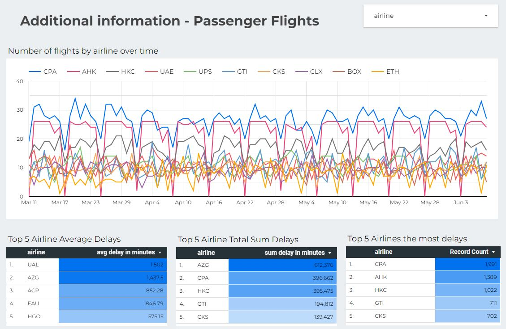

# Hong Kong Airport Flights 

For decades Hong Kong has been the world's busiest cargo gateway and passenger airport. The Hong Kong International Airport publishes flight information daily for cargo and passenger airlines which can provide insight to the latest trends.

This project is an ETL pipeline that pulls daily flight information from [HKIA](https://www.hongkongairport.com/) and loads it to a datalake. The data is transformed before loading to the data warehouse which is used by Google's Looker Studio to visualize the trends.  

## Architecture



We use Python to pull data from HKIA's API to the Google Cloud Storage (Datalake), then extract, transform and load data into a Postgres data warehouse. Looker Studio is the presentation layer that uses the data warehouse to build dashboards. The pipeline is orchestrated with Prefect that scheduled a daily job to pull data from HKIA.

All of the components are running as docker containers.

Tech Stack:
- Python - Programming langauge
- Postgres - Data Warehouse
- Google Cloud Storage - Datalake
- Docker - Containerization 
- Prefect - Orchestrator
- Looker Studio - Dashboard

## ETL Flow



- At project initialization, all flight data is pulled from HKIA for the past 90 days and saved to the datalake (HKIA only provides data up to 90 days ago).
- Once data is saved, it is extracted and transformed and written to PostgresDB. 
- Once the initialization is complete, an incremential ETL job is scheduled to trigger once a day.

## Setup
## Infrastruture:
This project is hosted in Google Cloud and uses the following resources:


- Firewall rules for Looker Studio [link](https://support.google.com/looker-studio/answer/13139222?sjid=5831544522428849886-AP#jul-14-2022)
    - 142.251.74.0/23
    - 2001:4860:4807::/48 (Optional, for platforms that support IPv6)

### Pre-requisites

1. Google Cloud Account
2. Github account
3. Docker

Fill in Google Service Account credentials in the file: hk-airport-flights/blocks/make_gcp_blocks.py

```shell
git clone https://github.com/lawko698/hk-airport-flights.git
cd hk-airport-flights

make up # start the docker containers on your computer & runs migrations under ./migrations
```

## Dashboard

[Looker Studio Dashboard Link](https://lookerstudio.google.com/s/nrimNtn3C94)

Some screenshots:






### Tear down infra

After you are done, make sure to destroy your cloud infrastructure.

```shell
make down # Stop docker containers on your computer
```

## Room for improvements
- Auto formatting, lint checks, & tests
- Terraform & startup scripts
- Setup CICD
